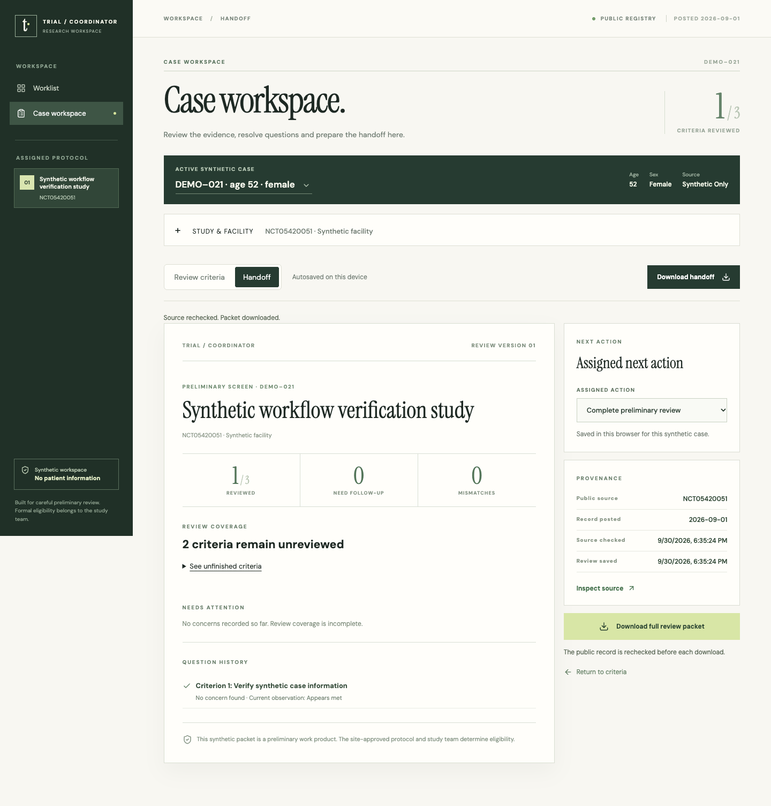

# Trial Coordinator



[Open private demo](https://trials.jordanmatthew.me) · Owner sign-in required.

Keep an incomplete preliminary trial review understandable as evidence and public study information change.

A private synthetic prototype with Worklist and Case workspace navigation. Review observations, study context, follow-ups and handoff share one case. Download is available directly from review, subject to a fresh source check.

## Technical decisions

- Typed registry adapter and detached source snapshots.
- Source changes pause reuse of earlier observations.
- Follow-up answers and review observations remain separate.
- Validated browser-local restoration with visible failure and recovery.
- Handoff retains uncertainty; no aggregate eligibility score.

## Reproduce

Node 22.13+ and npm:

```sh
npm ci
node --experimental-strip-types --test tests/*.test.mjs
npx tsc --noEmit
npm run build
npm start -- --port 4187
```

The canonical source passed 29 tests, TypeScript and build checks. External browser checks cover the full synthetic review loop and seven failure scenarios; these are not bundled portable tests.

See `docs/WORKSPACE_SIMPLIFICATION.md` for the current interface and `docs/ENGINEERING_CASE_STUDY.md` for its engineering background. Local persistence is not shared team storage. No patient screening, clinical eligibility validation, coordinator adoption or measured time savings is claimed. Independent usability review and final design acceptance remain open.

This is a release draft. Public repository links and original-work licensing remain pending.