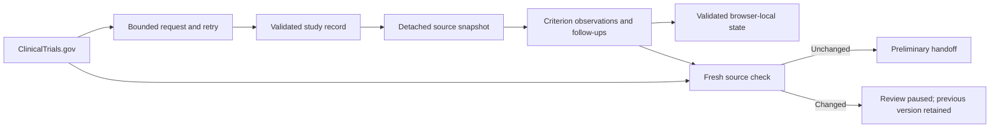

# Trial Coordinator: engineering a traceable preliminary review

## The question

Can a coordinator-facing interface keep an incomplete preliminary screen understandable as criteria, evidence, and public study information change?

The product hypothesis is that a case-centered workbench is useful for this task. It has not yet been validated with coordinators. The implementation demonstrates a complete synthetic review loop and makes its assumptions inspectable.

## Product decisions

The main workspace begins with assigned cases. Registry search supports protocol import. Each criterion keeps the original public wording, a human observation, a synthetic evidence category, and an optional follow-up task. An answer to a question does not automatically turn into an eligibility observation.

The handoff reports coverage, potential conflicts, and missing evidence separately. These counts can overlap. A possible exclusion is called a possible exclusion. There is no aggregate eligibility score.

## Data path

## Consequential edge cases

**Source changes.** A saved review has a source snapshot. Criteria, recruitment, sites, contacts, and structured limits are compared deterministically. A changed source pauses reuse; starting again archives the earlier observations. Posted-date changes alone do not prove the clinical content changed.

**Facility identity.** Facility context is captured by name and place, rather than trusting a mutable array position. It remains attached to review history. This is not a globally unique site identifier; the public source does not provide one through this adapter. Ambiguous duplicate facility labels remain a limitation.

**Freshness.** Handoff download requests an uncached public record. Failed checks block that download. Changes surface for review. The packet includes the time of the successful check. This verifies the public record available at request time, not local recruitment capacity or protocol approval.

**External failures.** One request budget bounds attempts and delays. Temporary failures retry at most twice. Short Retry-After delays are respected; longer delays return control to the user. Invalid JSON and unavailable records are not repeatedly retried.

**Local recovery.** Saved observations, follow-ups, snapshots, and archives are validated before restoration. Corruption pauses saving and exposes the original data for recovery. Explicit replacement first retains a browser recovery copy. This is not durable server storage or a regulated audit log.

## What this project demonstrates

A typed external-data boundary; deterministic state transitions; source versioning; provenance-aware interaction design; accessible focus management; constrained error recovery; and tests aimed at behavior that could mislead a reviewer.

AI-assisted development is part of the implementation process. Project claims should describe the decisions, verification, and working software accurately. No user-research results or clinical outcomes are implied by the technical test results.

## What remains

[Verification evidence](VERIFICATION.md) distinguishes automated tests, browser checks, and untested behavior. [Research planning](RESEARCH_PLAN.md) describes the coordinator feedback needed to validate the product hypothesis. Team collaboration, authoritative local protocols, real patient information, and clinical deployment are outside the current prototype.
